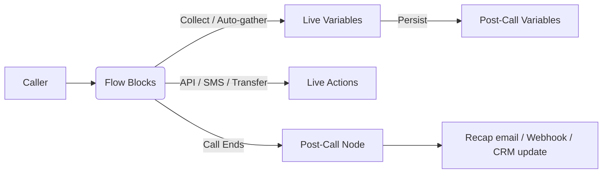

In this guide, we'll introduce you to Phonely's powerful variable system that serves as the backbone for capturing, storing, and reusing information throughout your call workflows.

Variables are the backbone of your agents. They capture data during a call, pass it between blocks, and export it after the call for follow-ups and analytics. This page extracts key concepts from the video and includes a complete, paste-ready catalog of live and post-call variables.

<Callout type="info">
If a block didn't run, its variable appears blank in post-call context. That's intentional so you can safely reference variables without breaking integrations.
</Callout>

  <iframe src="https://www.youtube.com/embed/mPRa7T5qJSo" title="Phonely Variables Guide" frameborder="0" allow="accelerometer; autoplay; clipboard-write; encrypted-media; gyroscope; picture-in-picture; web-share" referrerpolicy="strict-origin-when-cross-origin" allowfullscreen></iframe>

## Key Concepts

- **What variables are.** Structured data (caller phone, name, intent, outcomes, etc.) that your agent reads/writes at runtime and exposes after the call.
- **Where they live.**
  - Live-call variables exist while the conversation is running and power real-time logic (branching, transfers, API requests, messages).
  - Post-call variables are the finalized record (transcript, summary, sentiment, outcomes, links) used in emails, webhooks, CRMs, or BI.
- **How they're created.**
  - Prebuilt/telephony: injected automatically (numbers, timestamps, caller geo, caller ID).
  - Custom: you define once (e.g., an API key) and reuse anywhere.
  - Auto-gather: the agent asks for a value at the moment a block needs it (e.g., ask for name inside an API Request block).
- **Referencing variables.** Type `@` in any field to insert an available variable. You can also reference knowledge base docs via the same menu.
- **Live vs. post-call actions.**
  - Live actions happen during the call (API request, SMS, email, transfer, booking).
  - Post-call actions run only if the call ends at/after a specific node—useful for sending a recap email with recording, logging outcomes, or notifying a team.

## Variable Types & Capture Methods

### Prebuilt (Telephony/System)
Injected automatically when the call connects (numbers, timestamps, basic geo, caller ID).

### Custom
Define a key/value once (for example, `api_key`) and reuse across blocks and flows.

### Auto-gather
Prompt the caller at the moment a block needs a value (name, email, date, etc.)—no extra Talk block required.

<Tip>
In an API Request block, add a query/body field → choose "Auto-gather" → set type (Text, Email, Phone, Date, Time) and "Required." At runtime, the agent asks, then proceeds with the request.
</Tip>

## Full Variable Catalog

Names/keys below are shown in snake_case for clarity.

**Caller & Agent Context**
- **phone_number** (phone) - Your purchased Phonely number the call hit
- **customer_phone_number** (phone) - The caller's device number
- **agent_id** (string) - Unique ID of the agent
- **agent_name** (string) - Display name of the agent
- **workflow_id** (string) - Internal identifier for the active flow
- **workflow_name** (string) - Display name of the active flow

**Telephony/System Timestamps & IDs**
- **call_start** (datetime) - Exact start timestamp
- **call_end** (datetime) - Exact end timestamp
- **call_date** (date) - Convenience date
- **call_duration** (number) - Total elapsed seconds
- **call_id** (string) - Stable identifier for joins
- **caller_id** (string) - Not always present
- **caller_city** (string) - Area-code inferred; approximate
- **caller_zip** (string) - Area-code inferred; approximate

**Transcript & Links**
- **transcript_json** (json) - Structured turns w/ timing/meta
- **transcript_text** (text) - Plain text transcript
- **recording_url** (url) - Direct audio asset (no UI)
- **dashboard_url** (url) - Full UI (transcript, vars, analytics)

**AI Summaries & Classifications**
- **summary** (text) - Short recap
- **detailed_summary** (text) - ~5–10 sentences
- **call_success** (boolean) - Did the call achieve its goal?
- **sentiment** (enum) - happy, neutral, frustrated…
- **call_topic** (text) - Topical classification
- **call_purpose** (text) - Intent classification
- **key_points** (list) - Three-five highlights

**Auto-Extracted Entities**
- **extracted_dates** (list) - Dates mentioned by caller
- **extracted_times** (list) - Times mentioned
- **extracted_emails** (list) - Emails mentioned
- **extracted_names** (list) - Person names mentioned

**Follow-Up Signals & Actionables**
- **unanswered_questions** (list) - Unresolved
- **follow_up_required** (boolean) - Human attention recommended
- **follow_up_reason** (text) - Why needed
- **action_items** (list) - Next steps

**Outcomes & Endings**
- **outcome** (text) - Prefer explicit in-flow
- **ended_call_reason** (enum) - See allowed values below
- **last_block** (text) - Last block reached
- **call_direction** (enum) - inbound/outbound

**Ended call reason - allowed values**
- customer_hung_up
- ai_hung_up
- transferred
- silence_timeout
- voicemail_detected (outbound)
- greeting_hangup

**A/B Testing Fields (if used)**
- **ab_test_id** (string) - Internal reference
- **ab_test_name** (string) - Human-readable label
- **ab_test_type** (string) - e.g., prompt, voice, etc.

## Working with Variables in the Builder

**See what's available:**  
In any block field, type `@` to insert existing variables. You can also reference knowledge base docs with the same menu.

**Create custom variables:**  
Open the Variables modal and add keys you'll reuse (for example, `api_key`, `org_id`). This keeps requests consistent across flows.

**Use auto-gather where it matters:**  
Inside an API Request block, set a parameter's source to "Auto-gather," choose a type (Text, Email, Phone, Date, Time), and mark it required. The agent will ask at runtime and then proceed.

**Separate live vs post-call:**  
Attach a Post-Call node off the block you care about. Anything wired here runs only if the conversation ends there or later (for example, send recap email with `dashboard_url` and `recording_url`).

<Tip>
AI can infer an outcome, but explicit tagging on key branches produces cleaner dashboards and more reliable automation triggers.
</Tip>

<Warning>
If you rely on a variable that might be blank (because a block didn't run), add a fallback in your copy or condition. Example: "We couldn't capture your email; reply here and we'll add it."
</Warning>

## Practical Pattern: Auto-Gather Inside an API Request

**Scenario**: You're booking an appointment and need the caller's first name.

**Setup**: In the API block, add a body field `first_name` → choose Auto-gather → Type Text → mark Required.

**Result**: At runtime, the agent asks: "What's your first name?" and then proceeds to book without requiring an extra Talk block.

## Summary

- Prebuilt variables arrive from telephony (numbers, timestamps, caller geo).
- Custom variables keep configuration consistent across blocks.
- Auto-gather captures inputs exactly where you need them.
- Post-call variables give you the complete record: transcript, links, AI summaries, entities, outcomes, and reasons.
- Tag outcomes in-flow for clean reporting, and always guard for blanks.