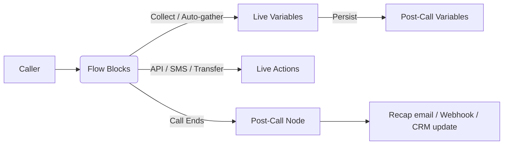

## Overview

In this guide, we'll introduce you to Phonely's powerful variable system that serves as the backbone for capturing, storing, and reusing information throughout your call workflows.

Variables are the backbone of your agents. They capture data during a call, pass it between blocks, and export it after the call for follow-ups and analytics. This page extracts key concepts from the video and includes a complete, paste-ready catalog of live and post-call variables.

<Info>
  If a block didn't run, its variable appears blank in post-call context. That's intentional so you can safely reference variables without breaking integrations.
</Info>

<iframe src="https://www.youtube.com/embed/mPRa7T5qJSo" title="YouTube video player" frameborder="0" className="w-full aspect-video rounded-xl" allow="accelerometer; autoplay; clipboard-write; encrypted-media; gyroscope; picture-in-picture; web-share" allowfullscreen />

## Key Concepts

**What variables are.**

Structured data (caller phone, name, intent, outcomes, etc.) that your agent reads/writes at runtime and exposes after the call.                                                                                                                                                                               

**Where they live.**

- Live-call variables exist while the conversation is running and power real-time logic (branching, transfers, API requests, messages).     
- Post-call variables are the finalized record (transcript, summary, sentiment, outcomes, links) used in emails, webhooks, CRMs, or BI.                                                        

**How they're created.**

- Prebuilt/telephony: injected automatically (numbers, timestamps, caller geo, caller ID).
- Custom: you define once (e.g., an API key) and reuse anywhere.
- Auto-gather: the agent asks for a value at the moment a block needs it (e.g., ask for name inside an API Request block).

**Referencing variables.**

Type `@` in any field to insert an available variable. You can also reference knowledge base docs via the same menu.

**Live vs. post-call actions.**

- Live actions happen during the call (API request, SMS, email, transfer, booking).
- Post-call actions run only if the call ends at/after a specific node—useful for sending a recap email with recording, logging outcomes, or notifying a team.

## Variable Types & Capture Methods

### Prebuilt (Telephony/System)

Injected automatically when the call connects (numbers, timestamps, basic geo, caller ID).

### Custom

Define a key/value once (for example, `api_key`) and reuse across blocks and flows.

### Auto-gather

Prompt the caller at the moment a block needs a value (name, email, date, etc.)—no extra Talk block required.        

<Tip>
  In an API Request block, add a query/body field → choose "Auto-gather" → set type (Text, Email, Phone, Date, Time) and "Required." At runtime, the agent asks, then proceeds with the request.
</Tip>

## Full Variable Catalog

### Caller & Agent Context

| Variable                  | Type     | When Set / Source    | Notes                                                      |
| :------------------------ | :------- | :------------------- | :--------------------------------------------------------- |
| **Business Phone Number** | `phone`  | Telephony (incoming) | The phone number of the agent receiving or making the call |
| **Customer Phone Number** | `phone`  | Telephony (incoming) | The phone number of the customer/caller                    |
| **Agent ID**              | `string` | Platform             | Unique identifier for the AI agent handling the call       |
| **Agent Name**            | `string` | Platform             | Display name of the AI agent                               |
| **Provider**              | `string` | Telephony            | The voice provider used for the call                       |
| **Workflow ID**           | `string` | Platform             | Internal identifier for the active flow                    |
| **Workflow Name**         | `string` | Platform             | Display name of the active flow                            |

### Telephony/System Timestamps & IDs

| Variable          | Type       | When Set / Source    | Notes                                           |
| :---------------- | :--------- | :------------------- | :---------------------------------------------- |
| **Call Started**  | `datetime` | Telephony            | Timestamp when the call started                 |
| **Call Ended**    | `datetime` | Telephony            | Timestamp when the call ended                   |
| **Call Date**     | `date`     | Telephony            | Date of the call                                |
| **Call Duration** | `number`   | Telephony            | Total duration of the call in seconds           |
| **Call ID**       | `string`   | Telephony/Platform   | Unique identifier for the call in Firestore     |
| **Call Time**     | `datetime` | Telephony            | Alternative timestamp for when the call started |
| **Caller ID**     | `string`   | Telephony (if avail) | Not always present                              |
| **Caller City**   | `string`   | Telephony (inferred) | Area-code inferred; approximate                 |
| **Caller Zip**    | `string`   | Telephony (inferred) | Area-code inferred; approximate                 |

### Transcript & Links

| Variable            | Type   | When Set / Source  | Notes                                                              |
| :------------------ | :----- | :----------------- | :----------------------------------------------------------------- |
| **Transcript**      | `json` | Post-call pipeline | Array/list of messages containing the full conversation transcript |
| **Transcript Text** | `text` | Post-call pipeline | Plain text version of the transcript                               |
| **Recording URL**   | `url`  | Telephony/Storage  | URL to access the call recording                                   |
| **Dashboard URL**   | `url`  | Platform           | URL to view the call details in the dashboard                      |

### AI Summaries & Classifications

| Variable         | Type         | When Set / Source | Notes                                                          |
| :--------------- | :----------- | :---------------- | :------------------------------------------------------------- |
| **Summary**      | `text`       | Post-call AI      | Brief summary of the call conversation                         |
| **Long Summary** | `text`       | Post-call AI      | Extended/detailed summary of the call conversation             |
| **AI Success**   | `boolean`    | Post-call AI      | Indicates whether the AI successfully handled the call         |
| **Sentiment**    | `enum`       | Post-call AI      | Detected sentiment/tone of the conversation                    |
| **Topic**        | `text`       | Post-call AI      | Main topic(s) discussed during the call                        |
| **Purpose**      | `text`       | Post-call AI      | The purpose or reason for the call                             |
| **Key Points**   | `list(text)` | Post-call AI      | Important points or highlights extracted from the conversation |

### Auto-Extracted Entities

| Variable            | Type          | When Set / Source | Notes                                       |
| :------------------ | :------------ | :---------------- | :------------------------------------------ |
| **Mentioned Date**  | `list(date)`  | Post-call AI      | Any date mentioned during the call          |
| **Mentioned Time**  | `list(time)`  | Post-call AI      | Any time mentioned during the call          |
| **Mentioned Email** | `list(email)` | Post-call AI      | Any email address mentioned during the call |
| **Caller Name**     | `list(text)`  | Post-call AI      | Name of the person calling (if captured)    |

### Follow-Up Signals & Actionables

| Variable                 | Type         | When Set / Source | Notes                                                      |
| :----------------------- | :----------- | :---------------- | :--------------------------------------------------------- |
| **Unanswered Questions** | `list(text)` | Post-call AI      | Questions that were asked but not answered during the call |
| **Follow Up**            | `boolean`    | Post-call AI      | Whether a follow-up is required                            |
| **Follow Up Reason**     | `text`       | Post-call AI      | Reason why a follow-up is needed                           |
| **Action Items**         | `list(text)` | Post-call AI      | List of action items identified from the call              |

### Outcomes & Endings

| Variable               | Type         | When Set / Source   | Notes                                             |
| :--------------------- | :----------- | :------------------ | :------------------------------------------------ |
| **Call Outcome**       | `text`       | Flow / Post-call AI | Overall outcome or result of the call             |
| **Ended Reason**       | `enum`       | Telephony/Platform  | Reason why the call ended                         |
| **Last Block**         | `text`       | Platform            | The last workflow block executed during the call  |
| **Call Direction**     | `enum`       | Telephony           | Direction of the call (inbound/outbound)          |
| **Action List**        | `list(text)` | Platform            | List of actions performed during the call         |
| **Workflow Triggered** | `boolean`    | Platform            | Whether a workflow was triggered during the call  |
| **Call Transferred**   | `boolean`    | Telephony/Platform  | Whether the call was transferred to another party |
| **Stored Variables**   | `json`       | Platform            | Variables stored during the call execution        |

#### Ended Call Reason - Allowed Values

- `customer_hung_up`
- `ai_hung_up`
- `transferred`
- `silence_timeout`
- `voicemail_detected` (outbound)
- `greeting_hangup`

### A/B Testing Fields

| Variable         | Type     | When Set / Source | Notes                                                |
| :--------------- | :------- | :---------------- | :--------------------------------------------------- |
| **AB Test ID**   | `string` | Experiment runner | Unique identifier for the A/B test (if applicable)   |
| **AB Test Name** | `string` | Experiment runner | Name of the A/B test (if applicable)                 |
| **AB Test Type** | `string` | Experiment runner | Type of A/B test variant ('A' or 'B', if applicable) |

## Working with Variables in the Builder

### See What's Available

In any block field, type `@` to insert existing variables. You can also reference knowledge base docs with the same menu.

### Create Custom Variables

Open the Variables modal and add keys you'll reuse (for example, `api_key`, `org_id`). This keeps requests consistent across flows.

### Use Auto-Gather Where It Matters

Inside an API Request block, set a parameter's source to "Auto-gather," choose a type (Text, Email, Phone, Date, Time), and mark it required. The agent will ask at runtime and then proceed.

### Separate Live vs Post-Call

Attach a Post-Call node off the block you care about. Anything wired here runs only if the conversation ends there or later (for example, send recap email with `dashboard_url` and `recording_url`).

<Tip>
  AI can infer an outcome, but explicit tagging on key branches produces cleaner dashboards and more reliable automation triggers.
</Tip>

<Warning>
  If you rely on a variable that might be blank (because a block didn't run), add a fallback in your copy or condition. Example: "We couldn't capture your email; reply here and we'll add it."
</Warning>

## Practical Pattern: Auto-Gather Inside an API Request

### Scenario

You're booking an appointment and need the caller's first name.

### Setup

In the API block, add a body field `first_name` → choose Auto-gather → Type Text → mark Required.

### Result

At runtime, the agent asks: "What's your first name?" and then proceeds to book without requiring an extra Talk block.

## Summary

- Prebuilt variables arrive from telephony (numbers, timestamps, caller geo).
- Custom variables keep configuration consistent across blocks.
- Auto-gather captures inputs exactly where you need them.
- Post-call variables give you the complete record: transcript, links, AI summaries, entities, outcomes, and reasons.
- Tag outcomes in-flow for clean reporting, and always guard for blanks.